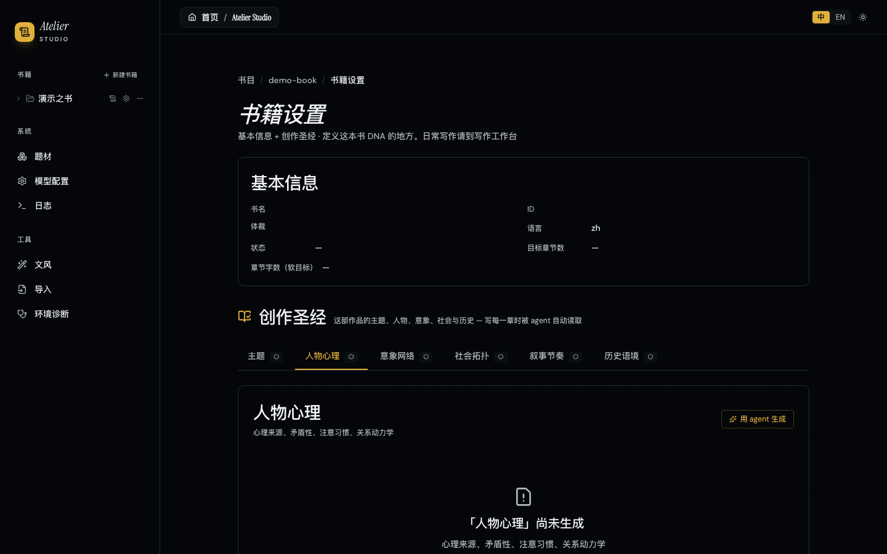
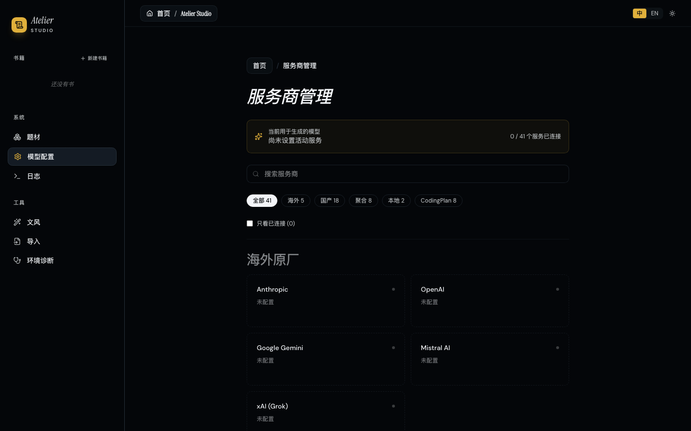

# Atelier — 自主 AI 严肃文学写作系统

> **产品 Showcase** | AI 产品经理方向 | Vibe Coding 实践  
> 一个从网文工业化工具重构为严肃文学创作助手的全栈 AI Agent 产品

---

## 一、一句话定位

**Atelier 是一个面向严肃文学创作的自主多 Agent 写作系统。** 它能基于作者提供的创作简报，自动构建主题骨架、人物心理档案、意象网络和社会拓扑，并通过 20 维度的文学审计自动审校每一章草稿，在"去 AI 味"的同时保留文学性。

---

## 二、为什么做这件事？

### 2.1 发现的痛点

当前市面上的 AI 写作工具（包括我从零参与维护并重构的开源项目 InkOS）存在一个根本矛盾：

- **网文工具**：追求"日更万字"的工业效率，输出的是高度同质化的"AI 味"爽文
- **通用写作助手**（如 Claude、ChatGPT）：缺乏长篇叙事的长期记忆，写到第 10 章就忘记第 2 章埋下的伏笔

**严肃文学创作者的真实需求被忽略了**：
- 他们需要的不只是"生成文字"，而是**保持主题一致性、人物心理深度、意象网络的长期演进**
- 他们害怕的不仅是"写不出来"，更是"写出来的东西像 AI 写的"
- 他们需要的不是一次性 prompt，而是一套**可演进、可审计、可回滚的创作控制面**

### 2.2 产品假设

> 如果为严肃文学构建一套"结构化长期记忆 + 文学维度审计 + 去 AI 味管线"，AI 能否辅助创作出真正有文学质感的长篇小说？

---

## 三、战略决策：从网文到严肃文学的范式迁移

这是整个项目最关键的产品决策。**不是功能叠加，而是范式替换。**

| 维度 | 原 InkOS（网文工具） | Atelier（严肃文学） |
|---|---|---|
| **核心指标** | 日更字数、平台 trending、读者留存 | 主题一致性、心理深度、意象网络密度 |
| **记忆模型** | 7 个通用真相文件（物资、伏笔、角色矩阵） | **+6 个文学真相文件**（主题、心理、意象、社会拓扑、节奏、历史） |
| **审计维度** | 33 维度连续性检查 | **+10 维度文学审计**（留白、潜台词、感官具体性、群像独立性等） |
| **体裁定义** | 玄幻/仙侠/都市等 12 个网文体裁 | 社会现实主义/乡村衰败/家庭史诗等 **8 个严肃文学体裁** |
| **自动化模式** | 后台守护进程自动量产 | **人工门控 + Agent 辅助**，每章必经审计 |
| **平台集成** | 市场雷达、平台格式导出 | **移除**，回归创作本体 |

**决策逻辑**：网文是"供给驱动"（平台要什么就写什么），严肃文学是"表达驱动"（作者有什么要说）。两种场景需要的控制面完全不同，无法在同一套产品里兼容。因此选择硬分叉，而非功能堆叠。

---

## 四、核心产品设计

### 4.1 架构设计：三层一致交互


*Atelier Studio 工作台首页 —— 书籍管理与创作入口*

```
┌─────────────────────────────────────────────────────────────┐
│  交互层（三端一致）                                           │
│  ┌─────────────┐  ┌─────────────┐  ┌─────────────────────┐  │
│  │ CLI 终端    │  │ TUI 仪表盘   │  │ Studio Web 工作台    │  │
│  │ (命令行)     │  │ (全屏交互)   │  │ (可视化编辑)         │  │
│  └──────┬──────┘  └──────┬──────┘  └──────────┬──────────┘  │
│         └─────────────────┴─────────────────────┘             │
│                           │                                 │
│              ┌────────────┴────────────┐                    │
│              │  共享交互运行时            │                    │
│              │  nl-router.ts + runtime.ts │                    │
│              └────────────┬────────────┘                    │
└───────────────────────────┼─────────────────────────────────┘
                            │
┌───────────────────────────┼─────────────────────────────────┐
│  引擎层（@atelier/core）    │                                 │
│  ┌────────────────────────┴────────────────────────────┐    │
│  │           多 Agent 写作管线（10+ Agent 接力）           │    │
│  │  Planner → Composer → Writer → Observer → Reflector   │    │
│  │       ↓                                              │    │
│  │  Normalizer → ContinuityAuditor → EditorialAuditor   │    │
│  │       ↓                                              │    │
│  │  Reviser（自动修复 / 人工门控）                        │    │
│  └──────────────────────────────────────────────────────┘    │
│  ┌──────────────────────────────────────────────────────┐    │
│  │  文学 Agent 集群（新增）                                │    │
│  │  ThematicAnalyst / CharacterPsychologist              │    │
│  │  SymbolWeaver / SocialTopologist                      │    │
│  └──────────────────────────────────────────────────────┘    │
│  ┌──────────────────────────────────────────────────────┐    │
│  │  结构化长期记忆（13 真相文件）                          │    │
│  │  7 通用 + 6 文学（JSON 权威 + Markdown 投影）           │    │
│  └──────────────────────────────────────────────────────┘    │
└─────────────────────────────────────────────────────────────┘
```

**产品意义**：无论作者在终端、全屏 TUI 还是 Web 工作台操作，自然语言指令被解析为相同的原子动作。这保证了三端体验的一致性，也为未来接入 OpenClaw 等外部 Agent 生态预留了标准接口。

### 4.2 文学真相文件：AI 的长期记忆工程

这是整个产品最核心的差异化设计。

**问题**：通用 LLM 的上下文窗口有限，写到第 20 章时，第 3 章埋下的核心意象、人物的心理塑形事件很容易被遗忘或扭曲。

**方案**：为严肃文学定义了 6 个结构化真相文件，作为"唯一事实来源"：

| 真相文件 | 解决什么问题 | 设计亮点 |
|---|---|---|
| **主题框架** | AI 写到后面忘记书在讲什么 | 核心命题 + 价值张力（真实的两难，非黑即白）+ 变奏路线 + 禁忌解 |
| **人物心理** | 人物行为前后不一致、标签化 | 聚焦"矛盾性"和"注意习惯"，而非 MBTI 式标签；关系动力学包含"永远说不出口的部分" |
| **意象网络** | 意象随意堆砌或前后断裂 | 每个意象有状态机（seeded → echoed → transformed → silent），约束同一意象不连续渲染 >2 次 |
| **社会拓扑** | 人物像在真空中行动 | 经济层、权力网络、文化系统、空间地理四子层，确保选择嵌在结构中 |
| **叙事节奏** | 章与章之间情绪曲线断裂 | 每章标注密度、强度等级、呼吸点 |
| **历史语境** | 时代错误、物质感缺失 | 政策锚点、物质锚点（物价/工资）、语言锚点（流行语/代际差） |

**关键设计决策**：
- **JSON 为权威来源，Markdown 为人类投影**：LLM 输出 JSON delta，由代码层做 immutable apply + Zod 校验后写入。避免 LLM 直接重写整份 markdown 导致的"坏数据雪崩"。
- **版本号预留**：每个 schema 内置 `schemaVersion`，为未来格式升级预留迁移路径。

### 4.3 EditorialAuditor：三层质量门禁

严肃文学不能靠"感觉"判断好坏，需要可重复、可解释的审计标准。

```
┌─────────────────────────────────────────┐
│  EditorialAuditor（三层合并审计）        │
├─────────────────────────────────────────┤
│  Layer 1: 连续性审计（33 维度）          │
│  → 角色记忆、物资连续性、伏笔回收、       │
│     大纲偏离、叙事节奏、情感弧线          │
├─────────────────────────────────────────┤
│  Layer 2: AI 痕迹检测（规则基）          │
│  → 疲劳词表、句式单调、过度总结、        │
│     高频副词、形容词堆砌                 │
├─────────────────────────────────────────┤
│  Layer 3: 文学维度审计（10 维度，LLM）   │
│  → 主题一致性、心理深度、矛盾性优先、     │
│     群像独立性、意象网络、留白与克制、    │
│     节奏呼吸、对话潜台词、感官具体性、    │
│     结局承认丧失                         │
└─────────────────────────────────────────┘
```

**最有产品思考的几个审计维度**：

- **留白与克制**：要求"至少一处主动省略"——关键事件不直写，让读者从前后侧面拼出。这是对 AI"过度解释"倾向的结构性纠偏。
- **对话潜台词**：要求"表层 A、里层 B"——如果一句对话不带潜台词就能被完全读懂，就是失败。这直接针对 AI 对话的"透明化"问题。
- **群像独立性**：配角必须像在过自己的日子，不能只服务主角。这是对 AI"主角中心主义"的结构性约束。
- **结局承认丧失**：阶段性收束必须让读者"闻到代价"。这是严肃文学与网文最根本的分界线。

**闭环设计**：审计不通过 → 自动进入"修订 → 再审计"循环，直到关键问题清零。作者始终保有最终审批权。

### 4.4 体裁系统：领域知识的 prompt 工程

严肃文学不是"没有规则"，而是有另一套规则。我们为 8 个严肃文学体裁构建了完整的"创作宪法"：

以「社会现实主义」为例：
- **章节类型**：处境章、对峙章、缝隙章、回响章、代价章（取代网文的"打脸章/突破章/收获章"）
- **疲劳词表**：冷笑、震惊、不可思议、深吸一口气、眼中闪过一丝…（禁止 AI 使用这些网文高频词）
- **语言铁律**：内心独白必须是这个具体的人在这个具体处境里能想到的话，不是社会学家在做分析
- **叙事禁忌**：禁止给"正派"开外挂式好运、禁止用形容词堆砌不公、禁止个人英雄式解决结构性问题
- **结局铁律**：结局承认丧失

**产品价值**：体裁配置不是 prompt 模板，而是"可版本化的领域知识库"。作者可以复制并自定义体裁，形成自己的创作宪法。

### 4.5 Studio 工作台：从"工具"到"创作空间"

Web 工作台的设计哲学是"低频率操作可视化，高频率操作对话化"。

**创作圣经（BookSettings）**：


*创作圣经 6 Tab 设计：主题 / 人物心理 / 意象网络 / 社会拓扑 / 叙事节奏 / 历史语境*


*人物心理档案：心理来源、矛盾性、注意习惯、关系动力学*

设计细节：
- 6 个 Tab 对应 6 个文学真相文件
- 每个文件支持「Agent 一键生成」和「JSON 精细编辑」两种模式
- 用颜色标记文件存在状态（● 已生成 / ○ 缺失）
- 提供对应的 CLI 命令提示，降低学习成本

**写作工作台（ChatPage）**：


*Chat-based 写作工作台：自然语言操作 + 快捷动作栏 + 右侧章节面板*

- 右侧助手面板接入共享交互内核
- 自然语言操作："写下一章，重点写师徒矛盾"、"审计第 5 章"、"把林烬改成张三"
- 实时显示 Agent 执行状态（计划 → 编排 → 写作 → 审计 → 修订）

**建书向导（BookCreateWizard）**：


*6 步引导式建书：从基本信息到主题、人物、意象、社会拓扑的 DNA 构建*

- 第一步即选择严肃文学体裁（社会现实主义、家族史诗、心理小说等）
- 每一步都可编辑或重新生成
- 跳过引导后可到「书籍设置」补足

---

## 五、Vibe Coding 实践

整个 Atelier 的重构是在 AI 辅助下完成的" vibe coding "实践：

| 实践 | 具体做法 |
|---|---|
| **AI 辅助架构设计** | 用 Claude 讨论 6 个文学真相文件的 schema 设计，迭代 5 轮确定字段粒度 |
| **AI 辅助 Prompt 工程** | 4 个新增 Agent 的系统 prompt 由 AI 生成初稿，人工审定"工作纪律"条款 |
| **AI 辅助代码生成** | Studio 的 `BookSettings.tsx`（1000+ 行）中 6 个 Tab 的只读视图由 AI 根据 Zod schema 自动生成 |
| **AI 辅助测试** | 文学审计维度的测试用例由 AI 根据 criterion 生成正反例 |
| **快速迭代** | 从决定转型到完成核心改造约 2 周，新增 22 个文件、修改 111 个文件 |

**关键经验**：vibe coding 不是"让 AI 写全部代码"，而是"让 AI 做它擅长的（样板代码、测试用例、文档），人类做决策（架构取舍、产品定义、prompt 调优）"。

---

## 六、当前进展与数据

### 6.1 核心指标

| 指标 | 数值 |
|---|---|
| 源文件（TS/TSX） | ~501 |
| 测试文件 | 159 |
| 新增文学 Agent | 4 |
| 文学真相文件 Schema | 6 |
| 文学审计维度 | 10 |
| 严肃文学体裁 | 8 |
| 删除网文功能模块 | 6 |
| Studio 页面重构 | 3 删 + 3 新增 |

### 6.2 功能完成度

- [x] 文学真相文件体系（Zod Schema + JSON 存储 + Markdown 投影）
- [x] 4 个文学 Agent（主题 / 人物 / 意象 / 社会）
- [x] EditorialAuditor（三层审计：连续性 + AI 痕迹 + 文学维度）
- [x] 8 个严肃文学体裁配置
- [x] Studio 创作圣经可视化（6 Tab 编辑 + Agent 生成）
- [x] CLI 新增文学命令
- [x] 管线 Prompt 文学化调优
- [ ] 叙事节奏 Agent 自动化（当前仅手动编辑）
- [ ] 英语 prompt 全面润色
- [ ] 测试全量通过验证

---

## 七、产品思考：几个关键设计决策

### 7.1 为什么用 JSON 而不是 Markdown 做权威存储？

LLM 直接重写 markdown 时，会"好心"地补充、改写、甚至删除原有内容。用 JSON + Zod 校验 + immutable delta apply，可以确保"坏数据"在写入前就被拒绝，不会滚雪球。

### 7.2 为什么删除守护进程自动量产？

网文可以"日更万字"是因为读者要的是情节推进，严肃文学每章都需要作者的判断。自动量产会导致主题漂移。产品应该辅助创作，而非替代创作。

### 7.3 为什么 10 个文学审计维度里包含"结局承认丧失"？

这是严肃文学与类型小说最本质的分界。网文追求"爽"，严肃文学追求"真"。如果把这条去掉，AI 会本能地写圆满结局，因为训练数据里圆满结局更多。必须通过审计维度做结构性纠偏。

### 7.4 为什么三端共享同一套交互运行时？

产品经理的视角：用户不应该因为换了界面就学到一套新的操作语言。TUI 里的 slash 命令、Studio 里的自然语言输入、CLI 里的 `atelier agent "..."`，最终都路由到相同的原子动作。这是"跨界面一致性"的基础设施。


*Studio 模型配置页：支持 41 个服务商，多模型路由*


---

## 八、我的角色与贡献

在这个项目中，我承担的是**产品负责人 + AI 产品经理**的角色：

1. **战略决策**：主导从网文工具到严肃文学系统的范式迁移，定义产品边界
2. **架构设计**：设计 6 个文学真相文件的 schema 体系和 10 维度文学审计标准
3. **Prompt 工程**：审校 4 个新增文学 Agent 的系统 prompt，确立"工作纪律"条款
4. **用户体验**：重构 Studio 信息架构，将"创作圣经"从隐藏配置提升为一级功能
5. **Vibe Coding**：在 AI 辅助下完成核心代码实现，验证"AI 辅助严肃文学创作"的产品假设

---

## 九、未来路线

- **局部干预**：重写半章 + 级联更新后续真相文件
- **自定义 Agent 插件**：让作者能注入自己的审计维度
- **文学社区**：体裁配置的共享与 fork

---

> **Atelier 的终极目标不是让 AI 代替作家，而是让作家能用 AI 守住更复杂的创作意图。**
