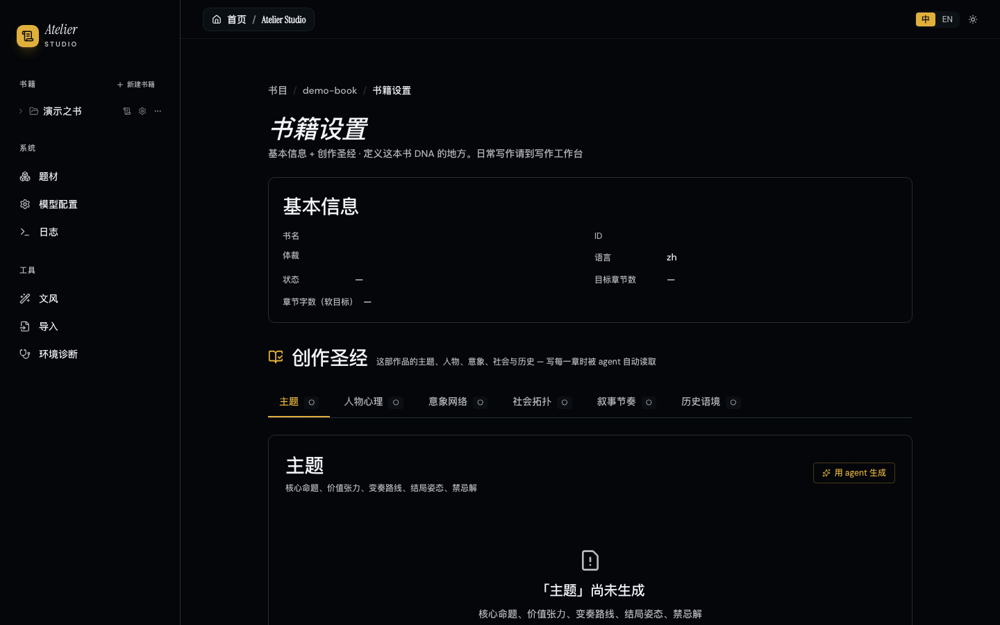
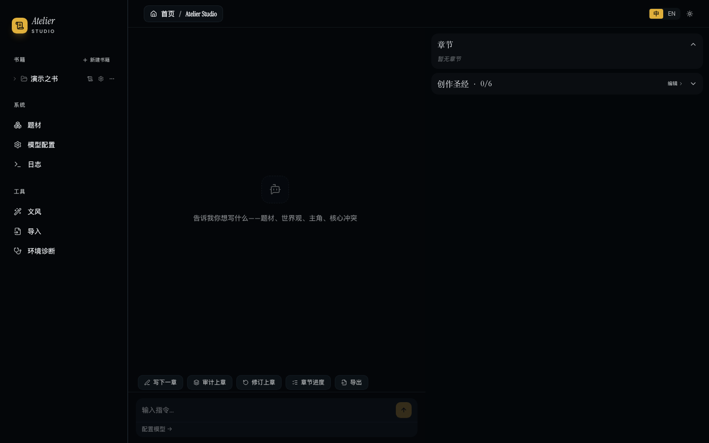

<p align="center">
  
</p>

<p align="center">
  
</p>

<p align="center">
  <a href="LICENSE"></a>
  
  
  
</p>

## 这是什么？

**Atelier 是一个面向严肃文学创作的自主多 Agent 写作系统。**

它能基于作者提供的创作简报，自动构建主题骨架、人物心理档案、意象网络和社会拓扑，并通过 20 维度的文学审计自动审校每一章草稿，在"去 AI 味"的同时保留文学性。

---

## 与 InkOS 的关系

Atelier **硬分叉**自 [InkOS](https://github.com/Narcooo/inkos)（AGPL-3.0）。我们在 InkOS 的网络文学基础设施之上，进行了彻底的**范式迁移**：

| | **InkOS** | **Atelier** |
|---|---|---|
| **目标** | 中文网文工业化量产 | 严肃文学精品创作 |
| **核心指标** | 日更字数、平台 trending | 主题一致性、心理深度、意象网络密度 |
| **审计维度** | 33 维度连续性检查 | **+10 维度文学审计**（留白、潜台词、群像独立性等） |
| **长期记忆** | 7 个通用真相文件 | **+6 个文学真相文件**（主题、心理、意象、社会拓扑、节奏、历史） |
| **体裁** | 玄幻/仙侠/都市等 12 个网文体裁 | 社会现实主义/家庭史诗/存在主义等 **8 个严肃文学体裁** |
| **自动化** | 守护进程后台自动量产 | **人工门控 + Agent 辅助**，每章必经审计 |
| **平台集成** | 市场雷达、平台格式导出 | **移除**，回归创作本体 |

> 两种场景需要的控制面完全不同，无法在同一套产品里兼容。因此我们选择硬分叉，从底层重构记忆模型、审计体系和创作管线，而非功能堆叠。

---

## 预览

<p align="center">
  
</p>

<p align="center">
  <em>Atelier Studio —— 书籍管理与创作入口</em>
</p>

| 建书向导 · 6 步 DNA 构建 | 创作圣经 · 主题框架 | 写作工作台 · Chat 式创作 |
|---|---|---|
|  |  |  |

---

## 核心设计

### 文学真相文件 —— AI 的长期记忆工程

为严肃文学定义了 6 个结构化真相文件，作为"唯一事实来源"：

| 真相文件 | 解决什么问题 | 关键设计 |
|---|---|---|
| **主题框架** | AI 写到后面忘记书在讲什么 | 核心命题 + 价值张力（真实的两难）+ 变奏路线 + 禁忌解 |
| **人物心理** | 人物行为前后不一致、标签化 | 聚焦"矛盾性"和"注意习惯"，包含"永远说不出口的部分" |
| **意象网络** | 意象随意堆砌或前后断裂 | 状态机推进：seeded → echoed → transformed → silent |
| **社会拓扑** | 人物像在真空中行动 | 经济层、权力网络、文化系统、空间地理四子层 |
| **叙事节奏** | 章与章之间情绪曲线断裂 | 每章标注密度、强度等级、呼吸点 |
| **历史语境** | 时代错误、物质感缺失 | 政策锚点、物质锚点、语言锚点、时代错位防护 |

**技术决策**：JSON 为权威来源，Markdown 为人类投影；LLM 输出 JSON delta，代码层做 immutable apply + Zod 校验后写入，防止"坏数据雪崩"。

### EditorialAuditor —— 三层质量门禁

```
连续性审计（33 维度）
  → 角色记忆、物资连续性、伏笔回收、大纲偏离、叙事节奏

AI 痕迹检测（规则基，9 维度）
  → 疲劳词表、句式单调、过度总结、高频副词

文学维度审计（10 维度，LLM 评估）
  → 主题一致性、心理深度、矛盾性优先、群像独立性、意象网络、
     留白与克制、节奏呼吸、对话潜台词、感官具体性、结局承认丧失
```

审计不通过 → 自动进入"修订 → 再审计"循环，直到关键问题清零。

### 严肃文学体裁系统

8 个内置体裁，每个定义章节类型、疲劳词表、叙事禁忌、语言铁律、审计维度：

社会现实主义 · 乡村衰败 · 心理现实主义 · 家庭史诗 · 存在主义 · 生态文学 · 历史小说 · 城乡迁移

### 三端一致交互

| 界面 | 入口 | 核心体验 |
|---|---|---|
| **Studio** | `atelier` | Web 可视化工作台 —— 创作圣经、Chat 式写作、模型配置 |
| **TUI** | `atelier tui` | 全屏终端仪表盘 —— slash 命令、流式对话、主题动效 |
| **CLI** | `atelier <cmd>` | 原子命令 —— 适合脚本编排和外部 Agent 调用 |

TUI、Studio Chat、`atelier interact` 共享同一套 `nl-router.ts` + `runtime.ts`，自然语言意图路由到相同的原子动作。

---

## 架构

```
┌─────────────────────────────────────────────┐
│  交互层：CLI / TUI / Studio Web              │
│  └──────────┬───────────────────────────────┘
│             │ 共享交互运行时 (nl-router + runtime)
├─────────────┼───────────────────────────────┤
│  引擎层 @atelier/core                        │
│  ├─ 多 Agent 写作管线（10+ Agent 接力）       │
│  │   Planner → Composer → Writer → Observer │
│  │   → Reflector → Normalizer → Editorial   │
│  │   Auditor → Reviser                      │
│  ├─ 文学 Agent 集群                          │
│  │   ThematicAnalyst / CharacterPsychologist│
│  │   SymbolWeaver / SocialTopologist        │
│  └─ 结构化长期记忆（13 真相文件）              │
│      7 通用 + 6 文学                         │
└─────────────────────────────────────────────┘
```

| 包 | 职责 | 技术栈 |
|---|---|---|
| `@atelier/core` | 引擎：Agent、管线编排、状态管理、LLM 抽象 | TypeScript, Zod, SQLite |
| `@atelier/cli` | 终端：命令、TUI 仪表盘、i18n | Commander.js, Ink, React 19 |
| `@atelier/studio` | Web 工作台：可视化编辑、服务配置 | Vite, React 19, Hono, Tailwind v4 |

---

## 快速开始

### 安装

```bash
npm i -g @atelier/core @atelier/cli
# 或克隆本仓库
pnpm install
pnpm build
```

### 配置 LLM

```bash
atelier config set-global \
  --provider <openai|anthropic|google|moonshot|...> \
  --base-url <API 地址> \
  --api-key <你的 API Key> \
  --model <模型名>
```

支持多模型路由：不同 Agent 可分配不同模型，按需平衡质量与成本。

### 写第一本书

```bash
atelier init my-novel
cd my-novel

# 方式一：命令行
atelier book create --title "河边" --genre social-realism
atelier theme 河边          # 生成主题框架
atelier character 河边      # 生成人物心理档案
atelier write next 河边     # 完整管线：计划 → 写作 → 审计 → 修订

# 方式二：Studio 工作台
atelier studio              # 启动 Web 界面，访问 http://localhost:4567
```

### 自然语言 Agent

```bash
atelier agent "写下一章，重点写师徒矛盾"
atelier agent "审计第 5 章"
atelier agent "把林烬改成张三，全量替换"
```

---

## 命令参考

| 命令 | 说明 |
|---|---|
| `atelier init [name]` | 初始化项目 |
| `atelier book create` | 创建新书（`--genre`、`--brief` 传入创作简报） |
| `atelier theme [id]` | 生成/优化主题框架 |
| `atelier character [id]` | 生成/优化人物心理档案 |
| `atelier symbol [id]` | 生成/优化意象网络 |
| `atelier social [id]` | 生成/优化社会拓扑 |
| `atelier plan chapter [id]` | 生成本章意图（不调用 LLM） |
| `atelier compose chapter [id]` | 生成本章上下文和规则栈（不调用 LLM） |
| `atelier write next [id]` | 完整管线写下一章 |
| `atelier audit [id] [n]` | 审计指定章节 |
| `atelier revise [id] [n]` | 修订指定章节 |
| `atelier agent <instruction>` | 自然语言 Agent 模式 |
| `atelier status [id]` | 项目状态 |
| `atelier export [id]` | 导出书籍（`--format txt/md/epub`） |
| `atelier detect [id] [n]` | AIGC 检测 |
| `atelier style analyze <file>` | 分析参考文本提取文风指纹 |
| `atelier doctor` | 诊断配置问题 |
| `atelier studio` | 启动 Web 工作台 |
| `atelier tui` | 启动 TUI 仪表盘 |

---

## 开发

```bash
pnpm install
pnpm dev          # 监听模式
pnpm test         # 运行测试
pnpm typecheck    # 类型检查
```

---

## 致谢

Atelier 是从 [InkOS](https://github.com/Narcooo/inkos)（AGPL-3.0）硬分叉并重构的严肃文学版本。感谢 InkOS 团队在网络文学 AI 写作领域的基础设施工作。

---

## 许可证

[AGPL-3.0](LICENSE)
